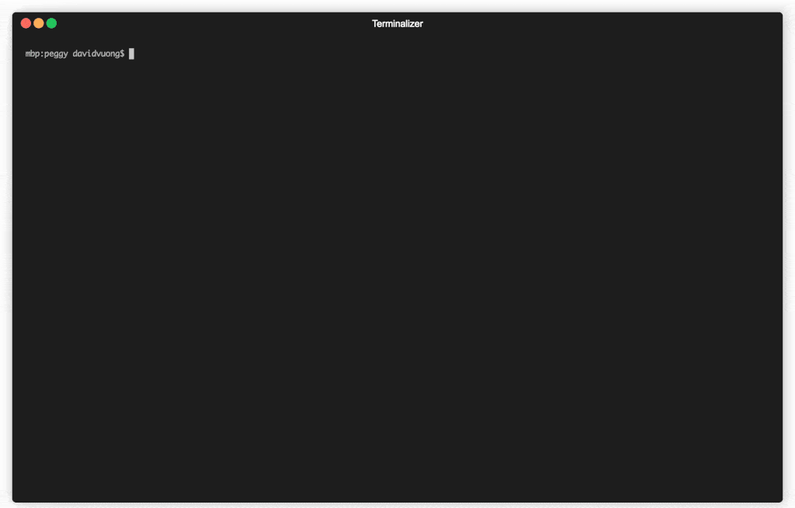

# peggy

[](https://github.com/prettier/prettier)
[](https://github.com/airbnb/javascript)

**Welcome to peggy!**

Peggy (or `peg` for short) is a CLI that helps you manage Terraform variables stored and loaded via JSON files. The primary goal is to ease the workflow necessary to pick and choose Docker images to be used for deployment.

Peggy helps by automating the process of connecting to a Docker registry, finding the image to deploy and updating the necessary files to have Terraform pick up changes. Peggy was inspired by previous work in a [similar tool (Mimiron)](https://github.com/davidvuong/mimiron) with related goals. Since then the landscape has changed significantly and Peggy is the next iteration of the same tooling.

**Supported registeries:**

- AWS ECR
- DockerHub (coming soon)

<p align="center">
  
</p>

## Workflow

There are often variable values used in your Terraform HCL which change based on environment. Most commonly updated is a reference to a Docker image stored in AWS ECR, DockerHub or any other image registry. You'll typically see them pulled out of HCL and placed into a [variable definition file](https://www.terraform.io/docs/configuration/variables.html#variable-definitions-tfvars-files) and then loaded when running `plan` or `apply`.

When you or a colleague wants to deploy or rollback to a previous image, a typical workflow might be:

1. Log into your CI/CD app
1. Navigate to your application's pipeline
1. Scroll to the artifacts section and find the Docker image you want to deploy
1. Manually copy the aritfact name, open your variables definitions file, and paste it over the current version

The process is tedious and error prone. `Peggy` automates this process for you, allowing you stay within the terminal.

_(see [examples directory](./examples/) for sample HCL configurations with JSON variable definitions.)_

## Installation

```bash
yarn global add @voltronstudio/peggy
```

## Usage

```
# Fetch the current status of your state by parsing your config
peg status

# Fetch the current status for a specific app
peg status <app>

# Fetch images in registry to deploy, targets production, and commits without pushing
peg bump <app> --env=production

# Fetches images in ECR to deploy, using the default env, commits, and pushes
peg bump <app> --push

# Fetches images from a differently name repository (by default it uses the same name as <app>)
peg bump <app> <repository>

# Validates the variables.json specified by <path>
peg validate <path>

# See help for more details
peg --help
peh <command> --help
```

## Variables.json

`Peggy` uses JSON to store variables outside of HCL. You can place these variables anywhere in your Terraform project, however it's expected that it should follow this directory structure:

```
└── variables
    ├── development.json
    ├── qa.json
    ├── preprod.json
    ├── uat.json
    ├── staging.json
    └── production.json
```

A single directory holding all `<env>.json` variables. `Peggy` provides a `validate` command to check the shape of your `variables.json`:

```bash
peg validate ./variables/development.json
```

See [./data/variables](./data/variables/development.json) for a sample variables.json. Also, see [./examples/kubernetes/variables](./examples/kubernetes/variables/development.json).

- `apps` is an object where the `key` is the name of your `application` e.g. `web`
- Each value in `apps` is configuration specific to your `application`
- An app can be thought of as a `pod` in Kubernetes or `service` in ECS
- Each `pod` have _one or many_ containers. When there's just one container, your `containers` can be an object rather than an array of objects
- Each `container` has an optional `extraAgs` object. It's a freeform object where you can pass additional options

## Configuration

Upon startup, `Peggy` will attempt to load a `.peggy` JSON file in the current working directory. You can override this behaviour, by passing `--config <path>` in each command. For example,

```bash
peg status --config ./data/config.json
```

- `defaultEnvironment` - Default environment, can be overriden with `--env <env>`
- `defaultAwsProfile` - AWS profile in ~/.aws/credentials to use when calling ECR
- `defaultAwsRegion` - Region of your ECR repositories
- `variablesPath` - Location of the directory to your variable definitions

See [./data/config.json](./data/config.json) for a sample config.

## Development

We're always happy to have others contribute to the project. To get started, clone the repository:

```bash
git clone git@github.com:voltronstudio/peggy.git
```

Install project dependencies:

```bash
yarn
```

Run tests:

```bash
yarn test
yarn test:coverage
```

Execute locally during development:

```bash
yarn ts-node ./src --help
```

If you don't have your editor configured to autoformat (`eslint` & `prettier`) and build (`tsc`):

```bash
yarn lint
yarn build
```

Made with ❤️ by [Voltron Studio](https://www.voltron.studio/)
